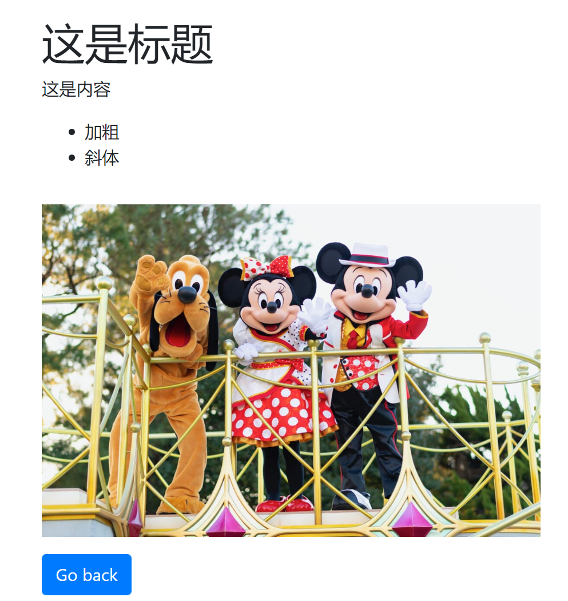

## 项目启动手顺
- 作为maven项目导入进sts之后正常启动即可
- 主页地址：http://localhost:8080/
- 数据库使用了H2，可以直接在浏览器里查看
    - 地址： http://localhost:8080/h2-console/
    - DB url： jdbc:h2:mem:testdb
    - 用户名：sa
    - 密码：password

## 展示效果

### 富文本编辑器输入页面


### 富文本编辑器展示页面


## 技术难点
- Demo中使用的富文本编辑器为[summernote](https://summernote.org/)
    - 开箱即用，方便配合bootstrap
- 富文本编辑器的内容存储在Post这个Java Bean里，标题和内容都以String存储
- 标题和内容的格式会转换为HTML标签以String存储
- 例如下面是存储在数据库里的样子
- 在controller里有log，所以可以在console里看到post这个对象的内容如下
```
这是标题
```

```
<p>这是内容</p><ul><li>加粗</li><li>斜体</li></ul><p></p><table class="table table-bordered"><tbody></tbody></table><p><br></p>)
```


